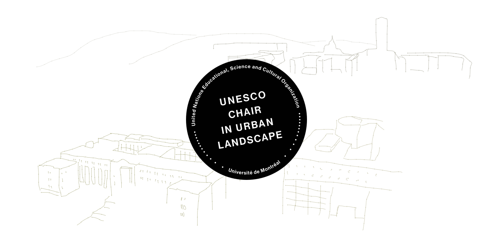

# Bienvenue!

Vous êtes présentement sur la page GitHub de la _Chaire UNESCO en paysage urbain de l’Université de Montréal_. Vous pouvez ici suivre le développement des différents projets et participer aux discussions et travaux de votre groupe.

## Liens utiles

:globe_with_meridians: La chaire détient aussi un site-vitrine:  http://www.unesco-paysage.umontreal.ca/

:bookmark_tabs: Pour consulter des informations plus complètes en ce qui concerne l'utilisation de la plateforme GitHub à la chaire, [référez-vous au _wiki_](https://github.com/CUPUM/.github/wiki).
